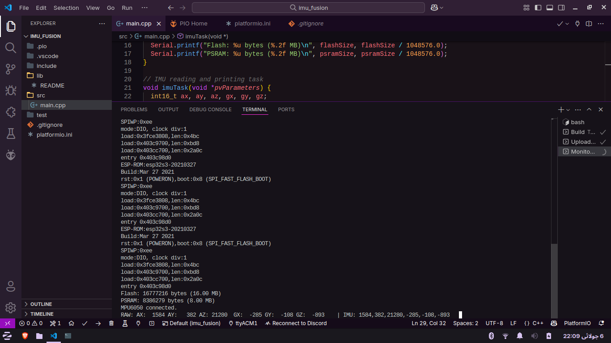

# GY521 (MPU6050) Gyroscope

**Date:** 2025-07-06
**Subsystem:** ESP32-S3
**Platform:** FreeRTOS + PlatformIO  
**Goal:** Print raw gyroscope 6DOF data on serial console

## Objective

- Verify that the IMU is functional
- Print 6DOF data on serial monitor
- Verify data consistency
- Create FreeRTOS task

## Scan Results

## Conclusion
The IMU6050 was successfully interfaced with the ESP32-S3 and works in its FreeRTOS task. The polling rate is 100hz.
