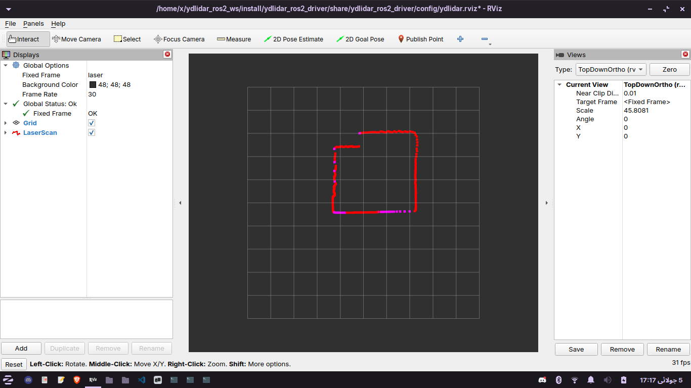

# YDLIDAR X3 Initial Setup

**Date:** 2025-07-05  
**Subsystem:** LiDAR (YDLIDAR X3)  
**Platform:** Ubuntu 22.04  
**Goal:** Test raw data reception from YDLIDAR X3 on publish /scan topic

## Objective

- Verify that the YDLIDAR X3 spins and transmits data when powered
- Set up ROS2 Humble and establish communication with the LIDAR
- Confirm that ROS2 driver on PC can process the data and publish /scan topic
- Confirm that the /scan topic shows an accurate laserscan on RVIZ

## Setup Steps

1. Install ROS2 driver (https://docs.ros.org/en/humble/Installation/Ubuntu-Install-Debs.html)
2. Create a workspace
3. Clone and compile the YDLIDAR SDK (https://github.com/YDLIDAR/YDLidar-SDK)
4. Clone ydlidar_ros2_driver and compile it
5. Run driver:
	```bash
	ros2 launch ydlidar_ros2_driver x3_ydlidar_launch.py
	```
6. Run RVIZ:
	```bash
	ros2 launch ydlidar_ros2_driver ydlidar_x3_view_launch.py
	```

## Scan Results


